  

---

`ONLINE`&nbsp;&nbsp;&nbsp;`BUILDING`&nbsp;&nbsp;&nbsp;`LEARNING`

 

<table align="center">
<tr>

<td align="center" width="33%">

### `SOFTWARE`

Backend · APIs

</td>

<td align="center" width="33%">

### `CYBERSECURITY`

Networks · Linux

</td>

<td align="center" width="33%">

### `IoT / ROBOTICS`

ESP32 · Arduino

</td>

</tr>
</table>

---

I like figuring out how things work underneath — code, networks, the systems that quietly hold everything together. Most of what's here is me building, breaking things on purpose, and learning by putting my hands in.

<strong>Software</strong>

 

`Python` `C#` `JavaScript`

Backend basics, small APIs, databases — still learning as I go.

<strong>Cybersecurity</strong>

 

`Linux` `Networking` `Security fundamentals`

Early stage — labs, CTF-style practice, reading a lot.

<strong>IoT / Robotics</strong>

 

`ESP32` `Arduino` `Embedded C/C++`

Mixing hardware and software, mostly to see things move.

---

<!-- 👉 Si estos son proyectos reales tuyos, dejalos y ajustá el link. Si no, borrá esta sección o reemplazala. -->

### Featured

<table>
<tr>

<td width="50%" valign="top">

**EnterpriseSimuler**
Small business-simulation project
`C#` · `.NET` · `SQLite`
[View →](https://github.com/fxrl01)

</td>

<td width="50%" valign="top">

**IoT / Robotics Lab**
Software × hardware experiments
`ESP32` · `Arduino`
[View →](https://github.com/fxrl01)

</td>

</tr>
</table>

---

**Currently**

Building `software` · `small systems` · `IoT experiments`
Learning `cybersecurity` · `networking` · `linux`

---

<!-- 👉 Reemplazá cada "#" por tu link real (LinkedIn, X, Discord, mailto:tuemail@...) -->

  

`FXRL01 // SYSTEM ONLINE`

