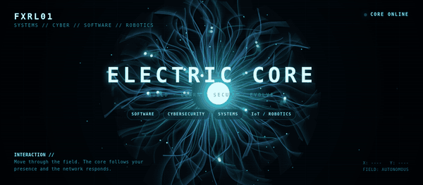

<!-- Fondo dinámico: banner con ondas animadas y degradado cian → violeta → azul -->

  

  

 

Me gusta entender cómo funcionan las cosas por dentro: el código, las redes y los sistemas que sostienen todo en silencio.
Casi todo lo que hay aquí es lo que construyo, y lo seguire haciendo.

 

<table align="center">
<tr>

<td align="center" width="33%" valign="top">

### 💻 Software

`Python` `C#` `JavaScript`

Backend, APIs pequeñas y bases de datos. Aprendiendo sobre la marcha.

</td>

<td align="center" width="33%" valign="top">

### 🛡️ Ciberseguridad

`Linux` `Redes` `Fundamentos`

Etapa inicial: laboratorios, práctica tipo CTF y mucha lectura.

</td>

<td align="center" width="33%" valign="top">

### 🤖 IoT y Robótica

`ESP32` `Arduino` `C/C++`

Mezclar hardware y software, sobre todo para ver cómo las cosas se mueven.

</td>

</table>

 

**Construyendo** `software` · `sistemas pequeños` · `experimentos IoT`

**Aprendiendo** `ciberseguridad` · `redes` · `linux`

 

<!-- 👉 Reemplaza cada "#" por tu enlace real (LinkedIn, X, Discord, mailto:tucorreo@...) -->

